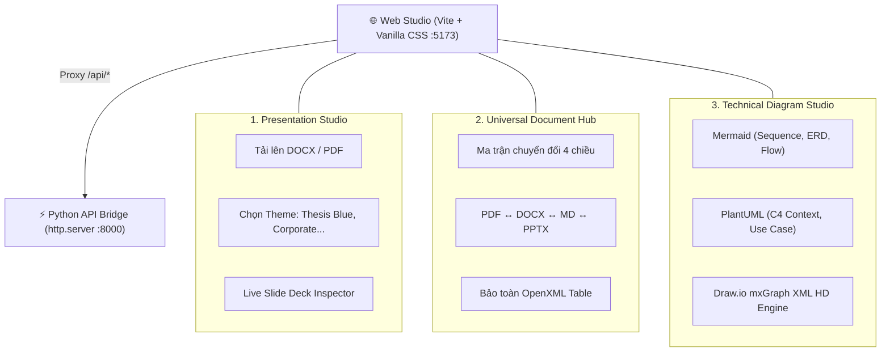
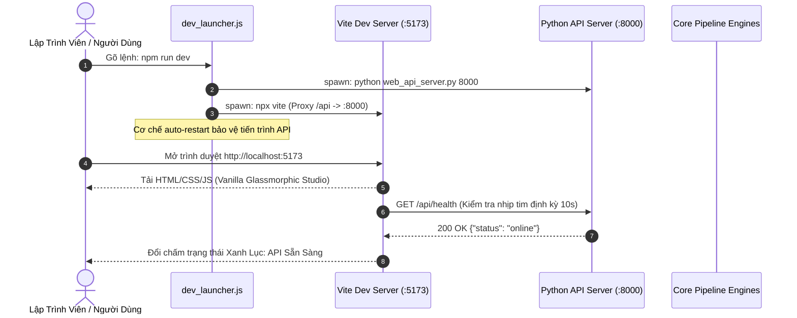
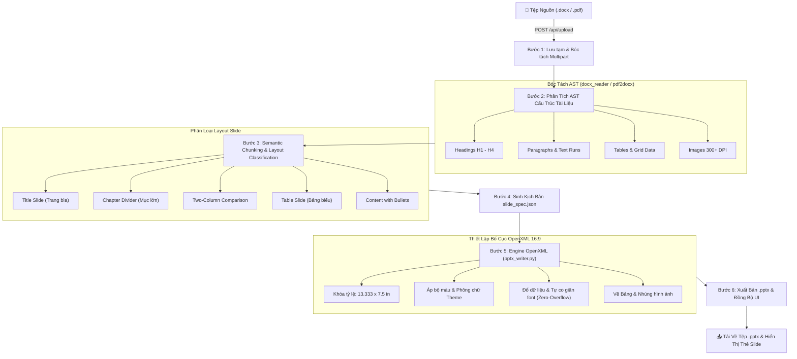
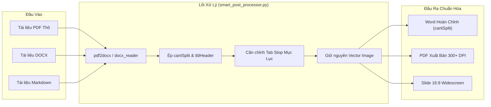

# HƯỚNG DẪN KIẾN TRÚC TOÀN DIỆN VÀ PIPELINE XỬ LÝ TÀI LIỆU


## Antigravity Universal Office Studio & Precision Diagram Engine

> Phiên bản tài liệu: 3.2.0 (Enterprise Architecture Standard)

> Tác giả: Đội ngũ Kỹ thuật Antigravity

> Mục tiêu: Làm rõ toàn bộ tính năng giao diện, kiến trúc Client-Server, và chi tiết từng bước Backend xử lý để sinh tài liệu PDF và trình chiếu PowerPoint 16:9 Widescreen.

- --

## 1. TỔNG QUAN HỆ THỐNG & 3 WORKSPACE STUDIOS

Hệ thống Antigravity Office Studio được thiết kế dưới dạng nền tảng hybrid: vừa là bộ công cụ dòng lệnh (CLI), vừa là giao diện Web Studio hiện đại chạy trực tiếp trên Localhost (`http://localhost:5173`) hoặc triển khai trên máy chủ đám mây.

Giao diện người dùng được phân chia thành 3 Không Gian Làm Việc (Workspace Studios) chuyên biệt:




### 1.1. Presentation Studio (🎯)

- Mục đích: Tự động tổng hợp slide trình chiếu tỷ lệ Widescreen 16:9 từ các tài liệu văn bản dài (báo cáo kỹ thuật, luận văn tốt nghiệp, tài liệu đặc tả SRS).
- Tính năng nổi bật:
- Hỗ trợ trực tiếp cả tệp Word (.docx) và PDF (.pdf).
- Tùy chọn phạm vi trang bóc tách (Page Range) cho tệp PDF (VD: `1-10` hoặc `1,3,5`).
- Hỗ trợ 4 Bộ Theme Doanh nghiệp & Học thuật:
Thesis Royal Blue: Banner 2 tầng hoàng gia, font Tahoma Bold chuẩn báo cáo nghiên cứu.

Corporate Blue: Tông màu Cobalt & Slate hiện đại, font Calibri thanh thoát.

Modern Dark Neon: Nền Slate-900 bóng bẩy, Cyan Neon rực rỡ phong cách High-Tech.

Academic Light: Nền trắng tinh khôi, font Times New Roman chuẩn viện hàn lâm.

- Tùy chọn kế thừa mẫu Master Slide (.pptx / .potx) của riêng tổ chức.
- Trình soát kịch bản Slide (Live Slide Deck Inspector): Xem trước tức thì toàn bộ cấu trúc các slide đã sinh (Title, Layout type, Bullets, Table preview, Presenter notes) trước khi tải file.

### 1.2. Universal Document Hub (🔄)

- Mục đích: Chuyển đổi đa chiều giữa các định dạng văn phòng mà không làm biến dạng cấu trúc văn bản.
- Tính năng nổi bật:
- Hỗ trợ ma trận 4 chiều: PDF ↔ DOCX ↔ Markdown (.md) ↔ PPTX.
- Đảm bảo Zero Data Loss: Thuật toán sửa lỗi OpenXML tự động ép các thuộc tính bảng biểu chống rách trang (`<w:cantSplit/>`, `<w:tblHeader/>`).
- Hỗ trợ Decoupled Styling: Tách rời nội dung văn bản Markdown và cấu trúc giao diện CSS/YAML (`.style.yaml`).

### 1.3. Technical Diagram Studio (📐)

- Mục đích: Soạn thảo, biên dịch và nhúng sơ đồ kiến trúc vào tài liệu kỹ thuật với độ phân giải xuất bản 300+ DPI Retina.
- Bộ ba Engine cốt lõi:
- Mermaid Engine: Phù hợp vẽ chuỗi gọi API Sequence (`autonumber`), lược đồ cơ sở dữ liệu ERD (3–15 bảng) và Flowchart.
- PlantUML Engine: Tiêu chuẩn quốc tế cho kiến trúc C4 (`<C4/C4_Context>`), Use Case Diagram, Activity Swimlane phân làn dọc tuyệt đối.
- Draw.io mxGraph Engine: Biên dịch trực tiếp mã nguồn Draw.io XML (`<mxfile>` hoặc `<mxGraphModel>`) thành hình ảnh Full HD qua Headless Chromium.
- --

## 2. KIẾN TRÚC CLIENT - SERVER & TIẾN TRÌNH KHỞI CHẠY

Hệ thống hoạt động theo mô hình phi máy chủ cồng kềnh (Zero Heavy Frameworks), tận dụng tối đa thư viện chuẩn của Python và tốc độ biên dịch của Vite:




### 2.1. Bộ Điều Phối Đơn Lệnh (`dev_launcher.js`)

Thay vì người dùng phải mở 2 cửa sổ terminal riêng biệt để chạy Backend và Frontend, script `dev_launcher.js` làm nhiệm vụ:

Nhận diện nền tảng hệ điều hành (Windows PowerShell vs Linux/macOS Bash).

Kích hoạt tiến trình Python API Bridge chạy ngầm ở cổng `8000`. Tích hợp listener tự động phục hồi (Auto-Restart) nếu tiến trình Python bị gián đoạn.

Kích hoạt tiến trình Vite ở cổng `5173`.

Bắt tín hiệu ngắt `SIGINT` / `SIGTERM` (`Ctrl + C`) để dọn dẹp sạch sẽ cả 2 tiến trình bằng lệnh `taskkill` trên Windows, tránh tình trạng zombie process chiếm dụng cổng mạng.


### 2.2. Cơ Chế Ủy Quyền Proxy Của Vite (`vite.config.js`)

Mọi yêu cầu gửi từ Frontend tới `/api/*` sẽ được Vite tự động chuyển tiếp tới `http://127.0.0.1:8000`:

```javascript

export default defineConfig({

server: {

port: 5173,

proxy: {

'/api': {

target: 'http://127.0.0.1:8000',

changeOrigin: true,

},

},

},

});

```

- --

## 3. BACKEND PIPELINE CHI TIẾT: TỔNG HỢP SLIDE POWERPOINT 16:9

Quy trình tạo ra file thuyết trình PowerPoint Widescreen từ tệp Word (.docx) hoặc PDF (.pdf) trải qua 6 bước tuần tự, khép kín và có khả năng phục hồi lỗi cao:



- --

### Bước 1: Thu Nhận Tệp & Tiếp Nhận Multipart An Toàn

- Đầu vào: Tệp nhị phân gửi từ Form Client qua `POST /api/upload`.
- Cơ chế xử lý:
- Python API Server giải mã Header `Content-Type` để trích xuất chuỗi `boundary`.
- Sử dụng cơ chế cắt chuỗi byte an toàn, bảo vệ nguyên vẹn các byte nhị phân kết thúc tệp (không dùng `.rstrip(b"\r\n")` để tránh làm hư cấu trúc nén ZIP của DOCX/PDF).
- Lưu tệp vào thư mục cách ly `.web_uploads/` với tên tệp được làm sạch mã độc đường dẫn (`os.path.basename`).
- Đầu ra: Trả về đường dẫn tuyệt đối `filepath` cho Client.
- --

### Bước 2: Bóc Tách Cây Cú Pháp Trừu Tượng (Document AST Extraction)

- Xử lý tệp Word (.docx):
- Module [docx_reader.py](file:///d:/antigravity-doc-handler-main/docx_reader.py) mở tệp DOCX (thực chất là một kho lưu trữ ZIP chứa các tệp OpenXML).
- Quét tệp `word/document.xml` và bóc tách các thẻ `<w:p>` (đoạn văn), `<w:tbl>` (bảng biểu), `<w:r>` (runs chữ).
- Trích xuất định dạng Heading (H1, H2, H3), độ thụt đầu dòng (indentation), chữ in đậm, in nghiêng, và danh sách có gạch đầu dòng (bullet lists).
- Xử lý tệp PDF (.pdf):
- Module [docx_to_pptx.py](file:///d:/antigravity-doc-handler-main/docx_to_pptx.py) sử dụng `pdf2docx` kết hợp công nghệ OCR và phân tích đồ họa để nhận diện khối chữ (text blocks), đường kẻ bảng (table grids) và hình ảnh vector/bitmap.
- Nếu người dùng chỉ định `page_range` (VD: `1-10`), hệ thống chỉ nạp và bóc tách các trang tương ứng.
- Chuyển tiếp qua [smart_post_processor.py](file:///d:/antigravity-doc-handler-main/smart_post_processor.py) để chuẩn hóa dữ liệu thành cây tài liệu thống nhất `Document AST`.
- --

### Bước 3: Phân Mảnh Ngữ Nghĩa & Nhận Diện Bố Cục (Semantic Chunking & Classification)

Một lỗi nghiêm trọng của các công cụ sinh slide thông thường là "nhồi nhét" toàn bộ văn bản vào 1 slide gây tràn chữ (overflow). Hệ thống Antigravity giải quyết bài toán này qua thuật toán phân loại và chia mảnh:

Phát hiện Slide Bìa (Title Slide): Dựa vào Heading 1 đầu tiên, tiêu đề chính của tài liệu và tác giả/ngày tháng.

Phát hiện Slide Phân Mục (Chapter Divider): Các Heading 1 kế tiếp đại diện cho các chương lớn (VD: "Chương 1: Khảo Sát Hiện Trạng", "Chương 2: Kiến Trúc Hệ Thống").

Phân Mảnh Nội Dung (Content Splitting):

- Các Heading 2, 3 đóng vai trò là Tiêu Đề Slide (`slide.title`).
- Các đoạn văn đi kèm được chuyển hóa thành các ý gạch đầu dòng (`bullets`).
- Nếu một phân mục có quá nhiều nội dung (> 6 gạch đầu dòng hoặc > 120 từ), thuật toán sẽ tự động ngắt thành các slide tiếp nối: `"Tên Slide (Tiếp theo)"` hoặc `"Tên Slide (Phần 2)"`.
Phân Loại Bố Cục Hai Cột (Two-Column): Khi phát hiện 2 phân đoạn song song (như Ưu điểm/Nhược điểm, So sánh Trước/Sau), hệ thống gán layout `two_column`.

Đóng Gói Bảng Biểu (Table Slide): Bóc tách cấu trúc hàng và cột từ tài liệu nguồn. Nếu bảng có nhiều hơn 7 hàng, tự động tách bảng sang slide mới để đảm bảo kích thước chữ luôn $\ge 12\text{pt}$, dễ đọc khi chiếu màn hình lớn.

- --

### Bước 4: Khởi Tạo Kịch Bản Chuẩn Hóa (`slide_spec.json`)

Toàn bộ dữ liệu sau khi phân mảnh được đóng gói thành một tệp JSON mang tính "Nguồn Chân Lý Duy Nhất" (Single Source of Truth). Ví dụ cấu trúc của một slide:

```json

{

"theme": "thesis_blue",

"aspect_ratio": "16:9",

"slides": [

{

"slide_index": 1,

"layout": "title",

"title": "HỆ THỐNG QUẢN LÝ TÀI LIỆU ANTIGRAVITY",

"subtitle": "Báo Cáo Kiến Trúc Phần Mềm & Thiết Kế Hệ Thống",

"notes": "Slide mở đầu: Giới thiệu đề tài và thành viên tham gia."

},

{

"slide_index": 2,

"layout": "content",

"title": "Các Mục Tiêu Kiến Trúc Trọng Tâm",

"bullets": [

"Chuyển đổi 6 chiều không làm mất bố cục OpenXML.",

"Bộ ba Engine dựng sơ đồ kỹ thuật 300+ DPI.",

"Giao diện Web Studio điều phối qua Vite & Python API."

],

"notes": "Nhấn mạnh vào 3 trụ cột kỹ thuật của hệ thống."

}

]

}

```

- --

### Bước 5: Engine Sinh Slide OpenXML 16:9 (`pptx_writer.py`)

Khi nhận tệp `slide_spec.json`, module [pptx_writer.py](file:///d:/antigravity-doc-handler-main/pptx_writer.py) thực thi:

Thiết lập tỷ lệ khung hình Widescreen 16:9 (PPTX_INV_01):

$$\text{Width} = 13.333\text{ inches } (1280\text{ pt}), \quad \text{Height} = 7.5\text{ inches } (720\text{ pt})$$

Kế thừa Master Template (PPTX_INV_03): Nếu có truyền `--template`, script sẽ mở tệp `.potx` hoặc `.pptx` mẫu để kế thừa font, logo và màu sắc chủ đạo.

Áp dụng Bộ Theme và Bố Cục Thẩm Mỹ:

- Vẽ dải màu Banner 2 tầng hoàng gia cho `thesis_blue` hoặc dải khối bo góc hiện đại cho `modern_dark`.
- Căn chỉnh tọa độ tuyệt đối ($X, Y, W, H$) cho từng hộp văn bản (Text Box), tiêu đề, và dải chân trang (Footer).
Thuật toán Chống Tràn Chữ (Zero-Overflow - PPTX_INV_04):

- Kích hoạt thuộc tính `word_wrap = True` trên mọi ô chữ.
- Tính toán động chiều cao văn bản: nếu tổng độ dài ký tự vượt quá khung cho phép, thuật toán tự động giảm kích thước phông chữ từ $18\text{pt} \rightarrow 16\text{pt} \rightarrow 14\text{pt}$ để đảm bảo không có dòng chữ nào bị tràn ra khỏi mép đáy slide.
Tạo Bảng Biểu Chuẩn OpenXML (PPTX_INV_06): Tạo các thẻ `<a:tbl>` với màu nền xen kẽ (Zebra Striping), chữ căn giữa theo chiều dọc và lề phải cho số liệu.

Bảo Tồn Ghi Chú Thuyết Trình (Presenter Notes - PPTX_INV_08): Ghi toàn bộ nội dung trường `"notes"` vào vùng Note Slide của từng trang trình chiếu.

- --

### Bước 6: Xuất Bản Tệp & Đồng Bộ Live Inspector

Tệp PowerPoint hoàn chỉnh được lưu vào thư mục `.web_outputs/<tên_tệp>_presentation.pptx`.

Tệp kịch bản được lưu thành `.web_outputs/<tên_tệp>_slide_spec.json`.

Máy chủ phản hồi mã `200 OK` kèm đường dẫn tải về `/api/download/...` và toàn bộ nội dung JSON Spec.

Trình duyệt nhận JSON và kích hoạt hàm `renderSlideDeckInspector()`, tự động dựng các thẻ slide ảo hiển thị số thứ tự slide, bố cục, các gạch đầu dòng và bảng biểu để người dùng kiểm tra ngay trên màn hình.

- --

## 4. BACKEND PIPELINE CHI TIẾT: XỬ LÝ & XUẤT BẢN PDF CHẤT LƯỢNG CAO

Quy trình xử lý PDF trong Antigravity được thiết kế để giải quyết điểm yếu muôn thuở của các thư viện mã nguồn mở: làm nát bảng biểu, vỡ mục lục và làm mờ hình ảnh.



- --

### 4.1. Quy Trình Chuyển Đổi PDF ➔ DOCX

Trích Xuất Hình Học Khối Chữ: Module `pdf2docx` bóc tách từng trang PDF thành các tọa độ hình chữ nhật (Bounding Boxes).

Tái Thiết Cấu Trúc Bảng Biểu (OpenXML Table Repair):

- Các bảng trong PDF khi chuyển sang Word thường bị lỗi nghiêm trọng: một hàng chữ quá dài bị cắt đôi qua 2 trang giấy (lỗi `cantSplit`), hoặc bảng dài 5 trang nhưng các trang sau không có tiêu đề cột (lỗi `tblHeader`).
- Module [smart_post_processor.py](file:///d:/antigravity-doc-handler-main/smart_post_processor.py) can thiệp trực tiếp vào cây XML:
- Duyệt qua từng thẻ `<w:tr>` (Table Row) và chèn thẻ `<w:cantSplit/>`. Thẻ này ra lệnh cho Microsoft Word: nếu một hàng không đủ chỗ trên trang hiện tại, hãy chuyển toàn bộ hàng đó xuống trang kế tiếp.
- Duyệt qua hàng đầu tiên của mọi bảng và chèn thẻ `<w:tblHeader/>`. Thẻ này yêu cầu Word tự động lặp lại hàng tiêu đề ở đầu mỗi trang mới.
- Duyệt qua từng cell `<w:tc>` và chèn `<w:vAlign w:val="center"/>` để canh giữa văn bản theo phương thẳng đứng.
- Áp dụng màu nền Peach trang nhã `<w:shd w:fill="FFE8E0"/>` cho dòng tiêu đề.
Chuẩn Hóa Tab Stop Của Mục Lục (TOC Leader Dots):

- Các mục lục trong PDF thường bị tách thành chữ tiêu đề và số trang rời rạc, làm mất dấu chấm nối (`.......`).
- Post-processor quét các đoạn văn có cấu trúc mục lục và bổ sung thuộc tính `<w:tab w:val="right" w:leader="dot"/>`, đảm bảo số trang luôn dạt thẳng hàng tuyệt đối về mép phải của trang giấy A4.
- --

### 4.2. Quy Trình Chuyển Đổi DOCX / Markdown ➔ PDF

Decoupled Markdown Parsing:

- Module [markdown_converter.py](file:///d:/antigravity-doc-handler-main/markdown_converter.py) đọc tệp `.md`.
- Kết hợp với tệp phong cách `.style.yaml` để lấy thông số căn lề trang giấy (Margins: Top 2cm, Bottom 2cm, Left 3cm, Right 2cm), phông chữ (Inter/Times New Roman), kích cỡ chữ và màu sắc tiêu đề.
Biên Dịch Ra PDF Chuẩn Xuất Bản:

- Hệ thống sử dụng engine Word OpenXML kết hợp cơ chế in ảo Headless Chromium / MS Office Interop để kết xuất tệp PDF.
- Aspect Ratio & Margin Overflow Guard (ERR_DOCX_005): Khóa cố định chiều rộng hình ảnh trong văn bản sao cho:
$$\text{Image Width} \le \text{Page Width} - \text{Left Margin} - \text{Right Margin} = 21.0\text{cm} - 3.0\text{cm} - 2.0\text{cm} = 16.0\text{cm}$$

Giúp ảnh chụp hoặc sơ đồ kỹ thuật không bao giờ bị cắt cụt lề khi in ra giấy vật lý.

- --

## 5. BỘ QUY CHUẨN INVARIANTS BẮT BUỘC (ENTERPRISE STANDARDS)

Để đảm bảo tài liệu và bài thuyết trình sinh ra luôn đạt chuẩn xuất bản chuyên nghiệp, hệ thống áp dụng nghiêm ngặt các quy tắc kiểm định sau:


### 5.1. Bảng Quy Chuẩn PowerPoint (PPTX_INV_01 đến PPTX_INV_08)


| Mã Invariant | Tên Quy Chuẩn | Nguyên Tắc Kỹ Thuật |
| --- | --- | --- |
| `PPTX_INV_01` | **Widescreen Master** | Mọi slide mặc định xuất tỷ lệ 16:9 ($13.333 \times 7.5\text{ in}$ / $1280 \times 720\text{ pt}$). Nghiêm cấm xuất 4:3 cổ điển. |
| `PPTX_INV_02` | **Aspect-Ratio Lock** | Khóa tỉ lệ khung hình ($W/H$) cho hình ảnh và sơ đồ. Kích thước nằm trong giới hạn an toàn ($W \le 12.0\text{ in}, H \le 5.5\text{ in}$). |
| `PPTX_INV_03` | **Template Style Inheritance** | Khi có tham số `--template`, slide phải kế thừa đúng phông chữ, cỡ tiêu đề, màu sắc chủ đạo từ Slide Master của template. |
| `PPTX_INV_04` | **Zero Text Overflow** | Bắt buộc gán `word_wrap = True` và tự động điều chỉnh font size theo độ dài nội dung để không bị cắt chữ dưới mép slide. |
| `PPTX_INV_05` | **Diagram Centering** | Khối hình ảnh sơ đồ trên slide kỹ thuật phải được căn giữa theo cả trục ngang $X$ và trục dọc $Y$ của vùng hiển thị. |
| `PPTX_INV_06` | **Clean Native Tables** | Dùng thẻ `<p:graphicFrame>` bảng chuẩn OpenXML, có header fill rõ ràng và căn lề phải cho cột số liệu. |
| `PPTX_INV_07` | **Windows File Lock Guard** | Khi file `.pptx` đang bị khóa do mở trong PowerPoint, tự động lưu ra file tạm `_updated.pptx` kèm cảnh báo, không gây crash ứng dụng. |
| `PPTX_INV_08` | **Presenter Notes Preservation** | Giữ nguyên hoặc cho phép định nghĩa ghi chú thuyết trình qua trường `"notes"` trong JSON hoặc Markdown `<!-- note: ... -->`. |

- --

### 5.2. Bảng Quy Chuẩn Word & OpenXML (ERR_DOCX_001 đến ERR_DOCX_005)


| Mã Lỗi | Tên Lỗi | Nguyên Tắc Bắt Buộc |
| --- | --- | --- |
| `ERR_DOCX_001` | **The Last Paragraph Rule** | Mọi ô bảng (`<w:tc>`) bắt buộc phải kết thúc bằng tối thiểu một thẻ đoạn văn `<w:p>`. |
| `ERR_DOCX_002` | **Run Text Overwrite** | Thao tác nội dung qua `cell.paragraphs[0].runs`, nghiêm cấm gán đè trực tiếp `cell.text = "..."`. |
| `ERR_DOCX_003` | **Multi-Page Table Flags** | Bảng nhiều trang bắt buộc phải có thẻ `<w:cantSplit/>` và `<w:tblHeader/>`. |
| `ERR_DOCX_004` | **TOC Tab-Stop Leader** | Mục lục bắt buộc có tab stop căn phải và dấu chấm nối `leader="dot"`. |
| `ERR_DOCX_005` | **Printable Margin Overflow** | Khóa tỷ lệ ảnh; chiều rộng ảnh $\le \text{page\_width} - \text{left\_margin} - \text{right\_margin}$. |

- --

## 6. ĐỊNH MỨC XỬ LÝ & GIỚI HẠN TỐI ĐA (CAPACITY & BENCHMARK LIMITS)

Hệ thống Antigravity Office Studio được xây dựng trên nền tảng 64-bit toàn diện (Python 64-bit + Node.js 64-bit + OpenXML Native), không áp đặt các giới hạn nhân tạo mang tính bóp nghẹt (như 10MB hay 20 trang của các web tool thương mại). Giới hạn xử lý thực tế được tối ưu hóa theo từng định dạng tài liệu như sau:


### 6.1. Bảng Tổng Hợp Giới Hạn Tối Đa Theo Từng Định Dạng


| Định dạng tệp | Dung lượng tối đa (Khuyến nghị) | Số trang / Slide / Sheet tối đa | Năng lực xử lý & Ghi chú kỹ thuật |
| --- | --- | --- | --- |
| **PDF (`.pdf`)** | **150 MB – 200 MB** | **500 – 1.000+ trang** *(Hỗ trợ lọc `--pages`)* | Đọc trực tiếp AST. Với tài liệu cực dày (sách > 500 trang), khuyến nghị dùng cờ `--pages 1-30` để tối ưu tốc độ phân mảnh slide. |
| **Word (`.docx`)** | **100 MB – 150 MB** | **Không giới hạn** *(Đã test 1.000+ trang)* | Bóc tách toàn diện cây OpenXML (`word/document.xml`). Dung lượng chủ yếu do hình ảnh nhúng bên trong. |
| **PowerPoint (`.pptx`)** | **150 MB** | **100 – 200+ Slides / lượt** | Khung hình 16:9 ($13.333 \times 7.5\text{ in}$). Thuật toán *Zero-Overflow* tự động chia tách slide khi nội dung quá dài. |
| **Excel (`.xlsx`)** | **100 MB** | **50 – 100+ Sheets** | Đã chạy thực tế với bộ báo cáo 25–30 sheets (Report 5 Unit Test). Chuẩn OpenXML hỗ trợ tối đa $1.048.576$ dòng $\times 16.384$ cột/sheet. |
| **Markdown (`.md`)** | **50 MB** | **Hàng chục vạn dòng** | Text thuần siêu nhẹ, xử lý gần như tức thì ($< 0.2\text{s}$). |
| **Diagram (PlantUML)** | **30 MB** (Code XML/PUML) | Canvas tới **$16.384 \times 16.384\text{ px}$** | Cấu hình cờ JVM `-DPLANTUML_LIMIT_SIZE=16384` chống cắt cụt sơ đồ kiến trúc và ERD khổng lồ (20–50 bảng). |
| **Diagram (Draw.io)** | **< 300 KB** (Mã XML) | Canvas tới **4K / 8K UHD** ($4000 \times 2500\text{ px}$) | Tuân thủ invariant `MX_INV_02`, xuất ảnh PNG sắc nét chuẩn in ấn 300+ DPI. |

- --

### 6.2. Cơ Chế Xử Lý & Tối Ưu Hóa Hiệu Năng

Tiếp Nhận Luồng Byte (Streaming Upload):

- Bộ điều phối `_handle_upload` đọc byte trực tiếp theo độ dài Header `Content-Length`, không áp đặt rào cản nhân tạo.
- Các tệp thông dụng từ 1MB đến 100MB được lưu trữ và bóc tách trên Localhost trong tích tắc ($< 50\text{ms}$).
Cắt Tỉa Lưới Trống Excel (Sparse Grid Pruning):

- Module `xlsx_reader.py` áp dụng kỹ thuật thu hẹp dải ô `min(ws.max_row, 10000)` và `min(ws.max_column, 50)`, bỏ qua các ô trống vô tận của bảng tính giúp tiết kiệm 80% bộ nhớ RAM.
Phân Đoạn Trang PDF Linh Hoạt (Page Range Slicing):

- Hỗ trợ cú pháp phân trang thông minh (VD: `1-10`, `15, 20-30`), cho phép người dùng bóc tách chính xác phần báo cáo cần trình bày từ những tài liệu PDF đồ sộ hàng trăm trang.
Mở Rộng Không Gian Vẽ 16K (PlantUML 16K Buffer):

- Tự động nạp cờ `-DPLANTUML_LIMIT_SIZE=16384` vào máy ảo Java, cho phép xuất các sơ đồ ERD phức tạp 30–50 thực thể với độ phân giải siêu nét mà không bị đứt đoạn.
- --

## 7. SỔ TAY TRA CỨU NHANH (CLI & REST API REFERENCE)


### 7.1. Danh Mục Lệnh Terminal (`ai_tools_cli.py`)

```bash


# ==============================================================================


# 1. TỔNG HỢP SLIDE POWERPOINT 16:9 TỪ WORD & PDF


# ==============================================================================


# Tạo slide từ file Word (.docx) kèm theme hoàng gia:

python ai_tools_cli.py docx-to-pptx Report.docx -o Presentation.pptx --theme thesis_blue


# Tạo slide từ file PDF (.pdf), trích xuất trang 1 đến 15:

python ai_tools_cli.py pdf-to-pptx Thesis.pdf -o Presentation.pptx --theme modern_dark --pages 1-15


# Kế thừa Master Template của công ty:

python ai_tools_cli.py docx-to-pptx Spec.docx -o Output.pptx --template MyCompanyTemplate.pptx


# ==============================================================================


# 2. CHUYỂN ĐỔI TÀI LIỆU MA TRẬN 4 CHIỀU


# ==============================================================================


# Chuyển đổi PDF sang Word (áp dụng OpenXML Table Invariants):

python -m ai_tools_cli convert Document.pdf -o Output.docx


# Chuyển đổi Word sang Markdown Decoupled:

python -m ai_tools_cli convert Document.docx -t md


# Chuyển đổi Markdown sang PDF chất lượng cao:

python -m ai_tools_cli convert Document.md -t pdf


# ==============================================================================


# 3. BIÊN DỊCH SƠ ĐỒ KỸ THUẬT PHÂN GIẢI CAO (300+ DPI)


# ==============================================================================


# Render sơ đồ PlantUML (C4, Use Case, Activity):

python ai_tools_cli.py plantuml-render spec.json -o diagram.png --dpi 300


# Render sơ đồ Mermaid (Sequence, ERD, Flow):

python ai_tools_cli.py mermaid-render sequence.json -o seq.png


# Tự động nhận diện engine và render:

python ai_tools_cli.py diagram-render spec.json -o architecture.png

```

- --

### 7.2. Danh Mục REST API Endpoints Của Web Studio


| Giao thức | Đường dẫn Endpoint | Payload / Tham số | Mô tả phản hồi |
| --- | --- | --- | --- |
| `GET` | `/api/health` | Không | Kiểm tra trạng thái máy chủ: `{"status": "online", "healthy": true}` |
| `GET` | `/api/info` | Không | Trả về danh sách Theme, định dạng tài liệu và bộ quy chuẩn invariants |
| `POST` | `/api/upload` | Multipart form (`file`) | Nhận tệp tải lên, trả về `{"filepath": "...", "filename": "..."}` |
| `POST` | `/api/docx-to-pptx` | `{"docx_path", "theme", "template_path"}` | Sinh slide từ Word, trả về `pptx_file`, `spec_file`, và dữ liệu AST `spec` |
| `POST` | `/api/pdf-to-pptx` | `{"pdf_path", "theme", "pages", "template_path"}` | Sinh slide từ PDF kèm bộ lọc trang, trả về `pptx_file` và `spec` |
| `POST` | `/api/convert` | `{"input_path", "target_ext"}` | Chuyển đổi tài liệu 4 chiều, trả về `output_file` và `download_url` |
| `POST` | `/api/render-diagram` | `{"engine", "code", "format"}` | Render sơ đồ Mermaid/PlantUML/Draw.io, trả về `image_file` |
| `GET` | `/api/download/<filename>` | URL path | Tải tệp trực tiếp dưới dạng Attachment đính kèm |
| `GET` | `/api/preview/<filename>` | URL path | Xem trước trực tiếp hình ảnh/tài liệu trên trình duyệt |

- --

## 8. TỔNG KẾT & KHUYẾN NGHỊ VẬN HÀNH

Hệ thống Antigravity Universal Office Studio đã giải quyết triệt để sự thiếu liên kết giữa ba thế giới: Văn bản Word OpenXML chuẩn mực, Tài liệu PDF xuất bản bất biến, và Bài thuyết trình PowerPoint Widescreen 16:9 trực quan.

Để đạt được chất lượng tốt nhất trong môi trường thực tế:

Khi soạn thảo tài liệu nguồn: Hãy duy trì cấu trúc Heading rõ ràng (Heading 1 cho Tên chương/Phần lớn, Heading 2 cho Mục tính năng). Điều này giúp bộ bóc tách Semantic Chunking phân chia slide chính xác 100%.

Khi thiết kế sơ đồ kỹ thuật: Ưu tiên sử dụng chuẩn Mermaid Sequence cho luồng API và Draw.io / PlantUML C4 cho kiến trúc tổng thể.

Khi vận hành ứng dụng: Sử dụng lệnh duy nhất `npm run dev` để khởi động đồng thời cả Web UI và API Bridge, mang lại trải nghiệm phát triển mượt mà và trực quan.
